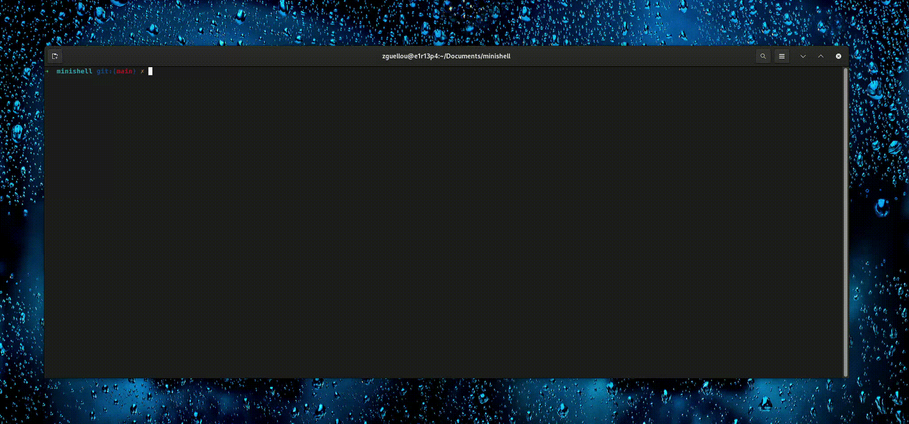

# Minishell 🐚



A simple UNIX command interpreter written in C as part of the 1337 School (42 Network) curriculum. This project recreates a basic shell with core functionalities similar to bash.

---

## Project Overview

**Minishell** is a team project where we created our own shell, implementing core functionalities including command execution, pipes, redirections, environment variables, and built in commands. The project emphasizes process management, file descriptors, and signal handling in C.

**Team:** [Zakaria Guellouch](https://github.com/itsmeyeshua) & [Charafeddine Toujana](https://github.com/Charaf3334)

---

## Features

- Display prompt with command history support
- Execute commands from `PATH`, relative, or absolute paths
- Handle single (`'`) and double (`"`) quotes
- Environment variable expansion (`$VAR`)
- Exit status variable (`$?`)
- **Redirections:**
  - `<` input redirection
  - `>` output redirection
  - `<<` heredoc (with delimiter)
  - `>>` output append mode
- **Pipes** (`|`) with multiple command chaining
- **Signal handling:** `Ctrl-C`, `Ctrl-D`, `Ctrl-\` (bash-like behavior)
- **Built in commands:**
  - `echo` with `-n` option
  - `cd` (relative/absolute paths)
  - `pwd`
  - `export` (no options)
  - `unset` (no options)
  - `env` (no options/arguments)
  - `exit` (no options)

---

##  Project Structure
```
minishell/
├── libft/        # Custom C library
├── parsing/      # Lexing, parsing, expanding
├── execution/    # Command execution
├── Makefile
├── main.c        # Entry point
├── minishell.h   # Main header file
└── minishell.gif # Demo GIF
```
---

## Compilation & Usage

```
git clone https://github.com/yourusername/minishell.git
cd minishell
make
./minishell
```

### Makefile Rules
```
make            # Compile minishell
make clean      # Remove object files
make fclean     # Remove object files and executable
make re         # Recompile everything
```

---

## Testing Examples

### Basic Commands
```
→ minishell>$ echo "Hello $USER"
Hello zguellou
→ minishell>$ ls -la | grep ".c" | wc -l
1337
```

### Redirections
```
→ minishell>$ echo "life is good" > file.txt
→ minishell>$ cat < file.txt
life is good
→ minishell>$ cat << EOF >> file.txt
heredoc line
EOF
```

### Pipes
```
→ minishell>$ ps aux | grep "minishell" | awk '{print $2}'
749506
764057
764060
```

### Environment Variables
```
→ minishell>$ export AGADIR="l3alima"
→ minishell>$ echo $AGADIR
l3alima
→ minishell>$ unset AGADIR
```

---

## Technical Insights

### **Development Approach**
We worked **collaboratively on all components** without fixed roles, using pair programming and continuous code review. Every feature was touched by both of us.

### **Key Challenges**
- **Parser-Executor Integration**: Ensuring seamless communication between layers
- **Memory Management**: Handling complex structures without leaks
- **Signal Handling**: Safe signal management in interactive mode
- **Heredoc**: Real time input with variable expansion

### **Architecture**
- **Modular Design**: Clean separation between parsing (`parsing/`) and execution (`execution/`)
- **Quote handling**: Specialized handling of shell syntax
- **Garbage collection**: Custom memory management

---

## Skills Gained
- **UNIX Systems**: Processes, file descriptors, signals
- **Collaboration**: Git workflow, pair programming, code reviews
- **C Programming**: Memory management, parsing, error handling
- **Debugging**: Valgrind and systematic testing

---

## 🛠️ Tech Stack
- **Language**: C (C99)
- **Compiler**: `cc` with `-Wall -Wextra -Werror`
- **Libraries**: readline, custom libft
- **Tools**: Git, Make and Valgrind

---

## Team Workflow
As our first team project, we:
1. **Planned together** (whiteboard sessions, task breakdown)
2. **Implemented in parallel** (both working on all modules)
3. **Integrated daily** (continuous testing and refinement)
4. **Debugged collaboratively** (memory leaks, signal issues)
5. **Polished together** (optimization)

---

## Final Thoughts
Minishell proved trickier than anticipated, every quote, pipe, and redirection had its own personality. Edge cases popped up everywhere. We rewrote the parser so many times we lost count, and our Git history became a tangled mess of commits and branches. At one point, we just wiped the slate clean and started fresh. In the end, it works! Massive thanks to my teammate Charaf, without him, I'd probably still be debugging signal handlers in my sleep.